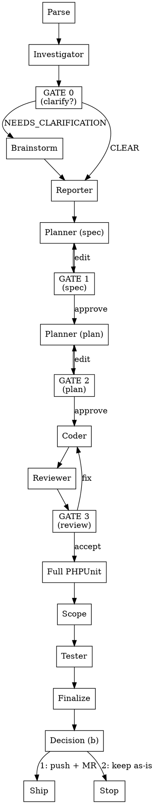

# UNIOSS Pipeline Orchestrator (main thread)

Drive a ticket from A to Z, stopping at every human gate.

Read `REFERENCE.md` (this dir) first — its branch, protected-branch, submodule, and commit rules are binding. You run in the MAIN thread: dispatch read-only stages as subagents, run the coder yourself, own the gates.

## Overview

Drive a ticket from A to Z, stopping at every human gate. The pipeline requires explicit user approval at each decision point before proceeding.

**Core principle:** it stops at human gates; never auto-merges.

**Track progress:** create a todo per Workflow step below and check each off as you complete it.

## Input

Three entry modes. All share the same gates, rounds, and stages; they differ only in what starts the run and which early steps are skipped.

- **ticket mode** — `/unioss-pipeline <url>` (default). New GitLab ticket, full flow from Investigate. `<PREFIX>` is `AP`/`FE` from the URL.
- **feedback mode** — `/unioss-feedback <url>`. Ticket already has ≥1 sealed round. Open round N+1 (never restart):
  1. Run Parse/round-setup (Flow step 1) to open round N+1.
  2. Re-fetch the ticket (`unioss-pipeline:unioss-gitlab-issue-context`); read only the **new comments since the last round**.
  3. Write `round-<N+1>/round-brief.md` from that comment delta; invoke `unioss-pipeline:unioss-brainstorming` on the feedback.
  4. Continue from the **spec** stage (Flow step 4) onward. Investigator (step 2) + GATE 0 (step 3) are skipped — the ticket was investigated in round 1. Prior rounds stay frozen.
- **task mode** — `/unioss-task <description>`. No GitLab ticket:
  1. Run Parse (Flow step 1): derive artifact identity `TASK-<short-slug>` (kebab-case of a few keywords); create `round-1/` + `.walkthrough/.pipeline/TASK-<slug>/`; write `round-1/round-brief.md` from the request.
  2. Run the normal Flow **from the investigator (step 2)**, but skip its GitLab fetch + DB-from-ticket steps — map impact from the request text + code only. No GitLab links in artifacts.

## Workflow

### State & resume

State file: `.walkthrough/.pipeline/<PREFIX>-[IID]/pipeline-state.json` — the machine-readable **source of truth**. Read state from here rather than inferring it from filenames. Keep `current_round` at the top level (the round + migration guards read `state.current_round`). Paths in `artifacts` are relative to `.walkthrough/`. Shape:

```json
{
  "schema_version": 1,
  "task": { "id": "FE-347", "title": "…", "type": "feature|bug", "status": "in_progress|completed" },
  "current_round": 1,
  "execution": { "created_at": "<iso8601>", "updated_at": "<iso8601>" },
  "rounds": { "<n>": { "stage": "finalized", "gate_decisions": { "gate_0": "clarified|skipped", "gate_1": "approved", "gate_2": "approved", "gate_3": "accepted" }, "spec_version": 1, "plan_version": 1, "review_counts": 1, "test_status": "pass|fail|pass-with-skips", "outcome": "passed|failed|partial", "open_issues": [], "carry_over": [] } },
  "artifacts": { "report": "FE-347/report.md", "scope": "FE-347/scope.md", "investigation": "FE-347/round-1/investigation.md", "spec": "FE-347/round-1/spec.md", "implementation": "FE-347/round-1/implementation.v1.md", "changes": "FE-347/round-1/changes.md", "review": "FE-347/round-1/review.md", "test_results": "FE-347/round-1/test-results.md" },
  "result": { "outcome": "passed|failed|pending", "tests_passed": 0, "tests_failed": 0, "requires_human_review": true }
}
```

Per-round fields: `stage` is `finalized` once the round is sealed (the sentinel the resume + sealed-round guard check) — any other value means in-progress. `gate_decisions` records each gate's outcome (`gate_0` clarify → `gate_1` spec → `gate_2` plan → `gate_3` review; `gate_0` is `skipped` on a re-run). `outcome` is `passed|failed|partial`; `open_issues` lists anything unresolved at close (e.g. a SKIPPED UI criterion); `carry_over` is the resulting to-do the next round must pick up. `spec_approved` is not stored — derive it from `gate_decisions.gate_1 === "approved"`.

On start, determine the round:

- No state / no `round-*` dirs → **round 1**. Set `current_round = 1`.
- Latest round **incomplete** (`stage` ≠ `finalized`) → resume it; do not open a new one.
- Latest round **sealed** (`stage = finalized`) **and** new work exists (ticket changed, or user instruction) → open **round N+1**.

Update the current round's entry after every stage: record each gate's result in `gate_decisions` (`gate_0` at Step 3, `gate_1` at GATE 1, `gate_2` at GATE 2, `gate_3` at GATE 3), the tester's `test_status` plus any SKIPPED/unresolved items into `open_issues`, and at Finalize set `stage = "finalized"`, `outcome`, `carry_over` (the `open_issues` the next round must pick up), plus the top-level `result` and `execution.updated_at`. On resume within a round: if `gate_decisions.gate_1 === "approved"`, skip the spec stage + GATE 1 and continue at the plan phase; otherwise resume at the spec stage.

**Round-open read-set (context compression).** To open round N+1, read only: this `pipeline-state.json` (outcome + artifact map + `current_round`), the ticket-root `report.md` and `scope.md`, and the prior round's `open_issues` / `carry_over`. Do **not** re-read the prior round's full artifact set (`investigation.md`, `spec.md`, `implementation.*`, `changes.md`, `review.md`, `test-results.md`) — pull a specific prior artifact only when a stage actually needs it. Seed `round-brief.md` from the prior `carry_over` plus the new ticket-comment delta.

### Step 0 — Show the plan, get the go-ahead

Parse the URL (REFERENCE regex) → IID + origin repo → prefix `AP`/`FE`. Render the plan table by running the script:

```bash
node "${CLAUDE_PLUGIN_ROOT}/scripts/plan-table.mjs" <PREFIX> [IID] <current_round>
```

Print its output per the **Output → Step 0** contract below, then **stop — ask the user to confirm before any stage runs.** Wait for them to say proceed. Run no stage until they confirm.

**Rounds.** Per-round artifacts go under `.walkthrough/<PREFIX>-[IID]/round-<current_round>/`; the `report.md` and `scope.md` deliverables sit at the ticket root `.walkthrough/<PREFIX>-[IID]/` and are overwritten each round (REFERENCE → Artifact layout). On a re-run (a sealed round exists), first write `round-<current_round>/round-brief.md` capturing exactly what this round must do (ticket delta since last round and/or user instruction), and state that all prior rounds stay frozen. Every stage is scoped to the brief and treats prior rounds as an immutable baseline. Never write outside the current round (sealed-round guard enforces this).

### Flow

1. **Parse** the URL → IID + origin repo → prefix. Determine `current_round`. Create `.walkthrough/.pipeline/<PREFIX>-[IID]/` and `.walkthrough/<PREFIX>-[IID]/round-<current_round>/`. Pass that round path to every subagent.
2. **Investigator** — dispatch the `unioss-pipeline:unioss-investigator` agent (**investigate mode**) with the URL. Writes `investigation.md` only; returns a clarity verdict + open-question count.
3. **GATE 0 — Clarify (conditional).** If verdict is `NEEDS_CLARIFICATION`: invoke the `unioss-pipeline:unioss-brainstorming` skill in THIS thread, work the numbered Open Questions with the user, then append a `## Clarifications` section to `investigation.md`. If `CLEAR`: skip.
   - **Step 3b — Reporter.** Dispatch the `unioss-pipeline:unioss-investigator` agent (**report mode**) with the `investigation.md` path. Writes the PM-facing `report.md` at the **ticket root** (`.walkthrough/<PREFIX>-[IID]/report.md`, a deliverable that spans rounds — overwritten, not under `round-<N>/`) from the now-clarified investigation. Always runs, whether or not GATE 0 clarified anything — the report must never be built on unanswered questions.
4. **Planner — spec mode.** Dispatch the `unioss-pipeline:unioss-planner` agent (spec mode) with the investigation path. Writes `spec.md` (what/why — scope, requirements, acceptance criteria; no code); returns path + one-line scope. Set `spec_version`.
5. **GATE 1 — Spec approval.** Present spec summary + path. **approve** → record `gate_decisions.gate_1 = "approved"`, go to step 6. **edit** → ask Decision prompt **(a)**, then re-dispatch spec mode with the feedback and re-present. Never proceed without approval.
6. **Planner — plan mode.** Dispatch the `unioss-pipeline:unioss-planner` agent (plan mode) with the approved `spec.md` path. Writes `implementation.v1.md` (exact per-file code); returns path + estimate points.
7. **GATE 2 — Plan approval.** Present plan summary + paths. The plan holds exact code, so this is a real code approval. On edits, ask Decision prompt **(a)**, then re-dispatch (plan mode) with the feedback and re-present until approved.
8. **Coder (this thread)** — invoke the `unioss-pipeline:unioss-implement` skill: apply the approved plan, run migrations if required, fast-verify new PHPUnit tests (AdminPage), write `changes.md`. It creates the correct feature branch off `v3-master` before its first edit per repo (REFERENCE branch rules) and follows the REFERENCE submodule flow for any common-code change.
9. **Reviewer** — dispatch the `unioss-pipeline:unioss-reviewer` agent with the `changes.md` path. Writes `review.md`; returns severity counts + top findings.
10. **GATE 3 — Review fix/accept.** Present findings by severity.
    - **fix** → invoke `unioss-pipeline:unioss-implement` to apply fixes + re-run filtered tests → ask "re-review or proceed?"; if re-review, go to step 9.
    - **accept** → (AdminPage) invoke `unioss-pipeline:unioss-implement` full mode: full suite with a fresh DB (`phpunit-config apply --import`) → `round-<current_round>/UT_#[IID]_[YYYYMMDD]_V1.txt`.
11. **Scope** — dispatch the `unioss-pipeline:unioss-scope` agent with the `changes.md` path + round path. Writes/updates `scope.md` at the ticket root (a sibling of `round-<N>/`, not inside it — see REFERENCE → Artifact layout); returns its path. Runs right after GATE 3 accept — the diff is final, and the scope reflects the code change, not the verification outcome. It runs **before** the tester so the tester consumes its affected features/URLs as a coverage source.
12. **Tester** — dispatch the `unioss-pipeline:unioss-tester` agent with the `changes.md` path + acceptance criteria + the ticket-root `scope.md` path. The tester derives its case set per `unioss-pipeline:unioss-test-evidence` (changes call sites × spec ACs × scope surfaces). Writes `test-results.md`; returns a `PASS`/`PARTIAL`/`FAIL` verdict plus the skipped-case list — record skips into the round's `open_issues`/`carry_over`. Never treat SKIPPED as a pass. If the tester returns a non-zero manual-hand-off count, tell the user their `## Manual Testing (run these yourself)` checklist awaits in `test-results.md`.
13. **Finalize** — for every repo the coder touched, commit on its feature branch using `#[IID] - [Message]`. Per REFERENCE: app branches (AdminPage/FrontEnd) are committed locally only (no push, no MR) and exclude the submodule gitlink; submodule branches are pushed. Never touch a protected branch. Present the final summary per **Output → Step 13**, then ask Decision prompt **(b)**.

### Flow diagram



## Output

### After every stage — announce its artifacts

The instant a stage returns, print the absolute path to each file it wrote, one per line, per REFERENCE → Artifact paths — **do not wait for Step 13.** This is mandatory for the gate-less stages the human would otherwise never see a link for: investigator (`investigation.md`), reporter (`report.md`), coder (`changes.md`, `api-spec.md`), scope (`scope.md`), and tester (`test-results.md`). Subagents return absolute paths; relay them verbatim — never downgrade to a relative path.

```
📄 `/abs/workspace/.walkthrough/AP-1583/round-1/investigation.md`
```

### Step 0 — the plan table

Print `plan-table.mjs` output **verbatim**, character-for-character, in a fenced code block:

````
```
<paste the FULL stdout of plan-table.mjs here — every row>
```

Confirm to start the Investigate stage?
````

It is already flush — never hand-draw, re-pad, reflow, rebuild, or summarize it into prose. This table is the payload, not decoration: **print it even when a brevity, concise, or terse-output style is active.**

### Step 13 — the final summary

- Branch per repo · spec · plan · changes · review status · test status · scope.
- The backticked absolute path to every artifact, including the ticket-root `scope.md` and `report.md`, each on its own line (REFERENCE → Artifact paths).
- If UI verification was SKIPPED, surface `UI verification: SKIPPED — no browser MCP configured` prominently.

## Decision prompts

Print these **verbatim** — exact wording, exact option order. Add no explanation, no extra options, no commentary before or after. Wait for the user's number.

**(a) Spec/plan change** — at GATE 1 or GATE 2, whenever the user wants the spec or plan changed:

```
Change requirement. What would you like to do?

1. Create a new version (V2, V3...)
2. Update current version

Which option?
```

- `1` → write the next version (`spec.v{n+1}.md` / `implementation.v{n+1}.md`); bump `spec_version` / `plan_version`.
- `2` → edit the current spec/plan file in place. No new file, no version bump.

**(b) Pipeline complete** — at the end of Flow step 13:

```
Implementation complete. What would you like to do?

1. Push and create a Merge to Staging
2. Keep work as-is (I'll handle it later)

Which option?
```

- `1` → invoke the `unioss-pipeline:unioss-ship` skill in `staging` mode.
- `2` → STOP. Nothing is pushed.

## Rules

- Never edit source except via the `unioss-pipeline:unioss-implement` coder step.
- Honor the gates — never run past Step 0, GATE 1, GATE 2, or GATE 3 without an explicit user decision.
- Protected branches are read-only (REFERENCE → Branches). Verify the current branch before any commit/push.
- Keep main context lean: rely on subagents' returned summaries; read full artifacts only when a gate needs it.
- Emit every artifact as an absolute path in backticks the moment it is written (REFERENCE → Artifact paths) — never a `file://` URL, a markdown link, or a relative path.

## Related files

- `./REFERENCE.md` — config, repos, branches, artifact layout, submodules, MCP.
- `scripts/plan-table.mjs` — renders the Step 0 table.
- `agents/unioss-investigator.md`, `unioss-planner.md`, `unioss-reviewer.md`, `unioss-tester.md`, `unioss-scope.md` — the dispatched subagents.
- `skills/unioss-implement/SKILL.md` — the coder (main thread).
- `skills/unioss-scope/SKILL.md` — the Step 11 scope writer (runs before the tester).
- `skills/unioss-ship/SKILL.md` — invoked by Decision prompt (b).
