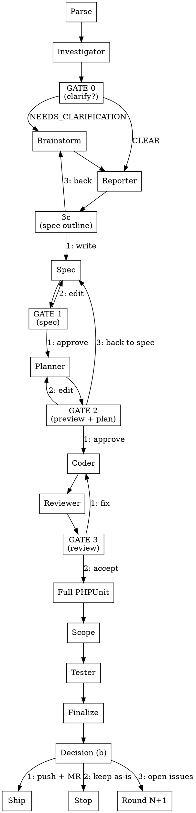

# UNIOSS Pipeline Orchestrator (main thread)

Drive a ticket from A to Z, stopping at every human gate.

Read `REFERENCE.md` (this dir) first. You also commit at Step 13, so `REFERENCE-git.md` — branch, protected-branch, submodule, and commit rules — is binding on you. You run in the MAIN thread: dispatch read-only stages as subagents, run the coder yourself, own the gates.

## Overview

The pipeline requires explicit user approval at each decision point before proceeding.

**Core principle:** it stops at human gates; never auto-merges.

## Input

Three entry modes. All share the same gates, rounds, and stages; they differ only in what starts the run and which early steps are skipped.

- **ticket mode** — `/unioss-pipeline <url>` (default). New GitLab ticket, full flow from Investigate. `<PREFIX>` is `AP`/`FE` from the URL.
- **feedback mode** — `/unioss-feedback <url>`. Ticket already has ≥1 sealed round. Open round N+1 (never restart):
  1. Read `pipeline-state.json`, determine latest round `N`, set `current_round = N + 1` in state, and create `round-<N+1>/` folder **before Step 0**.
  2. Re-fetch the ticket (`unioss-pipeline:unioss-gitlab-issue-context`); read only the **new comments since the last round**.
  3. Write `round-<N+1>/round-brief.md` from that comment delta; invoke `unioss-pipeline:unioss-brainstorming` on the feedback.
  4. Continue from the **spec** stage (Flow step 4) onward. Investigator (step 2) + GATE 0 (step 3) are skipped — the ticket was investigated in round 1. Prior rounds stay frozen.
- **task mode** — `/unioss-task <description>`. No GitLab ticket:
  1. Run Parse (Flow step 1): derive artifact identity `TASK-<short-slug>` (kebab-case of a few keywords); create `round-1/` + `.walkthrough/.pipeline/TASK-<slug>/`; write `round-1/round-brief.md` from the request.
  2. Run the normal Flow **from the investigator (step 2)**, but skip its GitLab fetch + DB-from-ticket steps — map impact from the request text + code only. No GitLab links in artifacts.

## Workflow

### State & resume

State file: `.walkthrough/.pipeline/<PREFIX>-[IID]/pipeline-state.json` — the machine-readable **source of truth**. Read state from here rather than inferring it from filenames. Keep `current_round` at the top level (the round + migration guards read `state.current_round`). Paths in `artifacts` are relative to `.walkthrough/`. Shape:

```json
{
	"schema_version": 1,
	"task": { "id": "FE-347", "title": "…", "type": "feature|bug", "status": "in_progress|completed" },
	"current_round": 1,
	"execution": { "created_at": "<iso8601>", "updated_at": "<iso8601>" },
	"rounds": {
		"<n>": {
			"stage": "finalized",
			"gate_decisions": { "gate_0": "clarified|skipped", "gate_1": "approved", "gate_2": "approved", "gate_3": "accepted" },
			"spec_version": 1,
			"plan_version": 1,
			"review_counts": 1,
			"test_status": "pass|fail|pass-with-skips",
			"outcome": "passed|failed|partial",
			"open_issues": [],
			"carry_over": []
		}
	},
	"artifacts": {
		"report": "FE-347/report.md",
		"scope": "FE-347/scope.md",
		"investigation": "FE-347/round-1/investigation.md",
		"spec": "FE-347/round-1/spec.md",
		"implementation": "FE-347/round-1/implementation.v1.md",
		"changes": "FE-347/round-1/changes.md",
		"review": "FE-347/round-1/review.md",
		"test_results": "FE-347/round-1/test-results.md"
	},
	"result": { "outcome": "passed|failed|pending", "tests_passed": 0, "tests_failed": 0, "requires_human_review": true }
}
```

Per-round fields: `stage` is `finalized` once the round is sealed (the sentinel the resume + sealed-round guard check) — any other value means in-progress. `gate_decisions` records each gate's outcome (`gate_0` clarify → `gate_1` spec → `gate_2` plan → `gate_3` review; `gate_0` is `skipped` on a re-run). `outcome` is `passed|failed|partial`; `open_issues` lists anything unresolved at close (e.g. a SKIPPED UI criterion); `carry_over` is the resulting to-do the next round must pick up. `spec_approved` is not stored — derive it from `gate_decisions.gate_1 === "approved"`.

On start, determine the round:

- No state / no `round-*` dirs → **round 1**. Set `current_round = 1`.
- Latest round **incomplete** (`stage` ≠ `finalized`) → resume it; do not open a new one.
- Latest round **sealed** (`stage = finalized`) **and** new work exists (ticket changed, or user instruction) → open **round N+1**.

Update the current round's entry after every stage: record each gate's result in `gate_decisions` (`gate_0` at Step 3, `gate_1` at GATE 1, `gate_2` at GATE 2, `gate_3` at GATE 3), the tester's `test_status` plus any SKIPPED/unresolved items into `open_issues`, and at Finalize set `stage = "finalized"`, `outcome`, `carry_over` (the `open_issues` the next round must pick up), plus the top-level `result` and `execution.updated_at`. On resume within a round: if `gate_decisions.gate_1 === "approved"`, skip the spec stage + GATE 1 and continue at the plan phase; otherwise resume at the spec stage.

**Round-open read-set (context compression).** To open round N+1, read only: this `pipeline-state.json` (outcome + artifact map + `current_round`), the ticket-root `report.md` and `scope.md`, and the prior round's `open_issues` / `carry_over`. Do **not** re-read the prior round's full artifact set (`investigation.md`, `spec.md`, `implementation.*`, `changes.md`, `review.md`, `test-results.md`) — pull a specific prior artifact only when a stage actually needs it. Seed `round-brief.md` from the prior `carry_over` plus the new ticket-comment delta.

### Step 0 — Show the plan, get the go-ahead

Parse the URL (REFERENCE regex) → IID + origin repo → prefix `AP`/`FE`. Render the plan table by running the script:

```bash
node "${CLAUDE_PLUGIN_ROOT}/scripts/plan-table.mjs" <PREFIX> [IID] <current_round>
```

Print the **Output → Step 0** blocks — the table, the branch list, the confirm line — that contract is fixed, so emit it identically every run — then **stop.** Wait for the user to confirm. Run no stage until they do.

**Rounds.** Per-round artifacts go under `.walkthrough/<PREFIX>-[IID]/round-<current_round>/`; the `report.md` and `scope.md` deliverables sit at the ticket root `.walkthrough/<PREFIX>-[IID]/` and are overwritten each round (REFERENCE → Artifact layout). On a re-run (a sealed round exists), first write `round-<current_round>/round-brief.md` capturing exactly what this round must do (ticket delta since last round and/or user instruction), and state that all prior rounds stay frozen. Every stage is scoped to the brief and treats prior rounds as an immutable baseline. Never write outside the current round (sealed-round guard enforces this).

### Flow

1. **Parse** the URL → IID + origin repo → prefix. Determine `current_round`. Create `.walkthrough/.pipeline/<PREFIX>-[IID]/` and `.walkthrough/<PREFIX>-[IID]/round-<current_round>/`. Pass that round path to every subagent.
2. **Investigator** — dispatch the `unioss-pipeline:unioss-investigator` agent with the URL. Writes `investigation.md` only; returns a clarity verdict + open-question count.
3. **GATE 0 — Clarify (conditional).** If verdict is `NEEDS_CLARIFICATION`: invoke the `unioss-pipeline:unioss-brainstorming` skill in THIS thread, work the numbered Open Questions with the user, then append a `## Clarifications` section to `investigation.md`. If `CLEAR`: skip.
   - **Step 3b — Reporter.** Dispatch the `unioss-pipeline:unioss-reporter` agent with the `investigation.md` path. Writes the PM-facing `report.md` at the **ticket root** (`.walkthrough/<PREFIX>-[IID]/report.md`, a deliverable that spans rounds — overwritten, not under `round-<N>/`) from the now-clarified investigation. Always runs, whether or not GATE 0 clarified anything — the report must never be built on unanswered questions.
   - **Step 3c — Spec outline confirm.** Print the `## Spec Outline` the investigator returned (goal, in/out of scope, requirement headlines, acceptance-criteria count), then ask Decision prompt **(c)**. Runs every round, whether or not GATE 0 clarified anything. This is the cheap approval of the spec's *shape* — the user confirms scope before a full `spec.md` exists, so a wrong direction costs an outline instead of a document.
4. **Spec** — dispatch the `unioss-pipeline:unioss-spec` agent with the investigation path. It expands the **approved** `## Spec Outline` into `spec.md` (what/why — scope, requirements, acceptance criteria; no code); returns path + one-line scope. Set `spec_version`.
5. **GATE 1 — Spec approval.** Present the spec summary + path, then ask Decision prompt **(d)**. Never proceed without approval.
6. **Planner** — dispatch the `unioss-pipeline:unioss-planner` agent with the approved `spec.md` path. Writes `implementation.v1.md` (exact per-file code); returns path, estimate points, and the file/migration counts the GATE 2 preview needs.
7. **GATE 2 — Plan approval.** The plan holds exact code, so this is a real code approval — and the last gate before anything is written to disk. Print the **Output → GATE 2** change preview (every file the plan creates, modifies, or deletes, per repo, plus migration DDL effects), then the plan path, then ask Decision prompt **(e)**. On edits, ask Decision prompt **(a)** first, then re-dispatch (plan mode) with the feedback and re-present the preview until approved.
8. **Coder (this thread)** — invoke the `unioss-pipeline:unioss-implement` skill: apply the approved plan, run migrations if required, fast-verify new PHPUnit tests (AdminPage), write `changes.md`. It creates the correct feature branch off `v3-master` before its first edit per repo (REFERENCE-git branch rules) and follows the REFERENCE-git submodule flow for any common-code change.
9. **Reviewer** — dispatch the `unioss-pipeline:unioss-reviewer` agent with the `changes.md` path. Writes `review.md`; returns severity counts + top findings.
10. **GATE 3 — Review fix/accept.** Present findings by severity, then ask Decision prompt **(f)**.
    - **fix** → invoke `unioss-pipeline:unioss-implement` to apply fixes + re-run filtered tests, then ask Decision prompt **(g)**; on re-review, go to step 9.
    - **accept** → (AdminPage) invoke `unioss-pipeline:unioss-implement` full mode: full suite with a fresh DB (`phpunit-config apply --import`) → `round-<current_round>/UT_#[IID]_[YYYYMMDD]_V1.txt`.
11. **Scope** — dispatch the `unioss-pipeline:unioss-scope` agent with the `changes.md` path + round path. Writes/updates `scope.md` at the ticket root (a sibling of `round-<N>/`, not inside it — see REFERENCE → Artifact layout); returns its path. Runs right after GATE 3 accept — the diff is final, and the scope reflects the code change, not the verification outcome. It runs **before** the tester so the tester consumes its affected features/URLs as a coverage source.
12. **Tester** — dispatch the `unioss-pipeline:unioss-tester` agent with the `changes.md` path + acceptance criteria + the ticket-root `scope.md` path. The tester derives its case set per `unioss-pipeline:unioss-test-evidence` (changes call sites × spec ACs × scope surfaces). Writes `test-results.md`; returns a `PASS`/`PARTIAL`/`FAIL` verdict plus the skipped-case list — record skips into the round's `open_issues`/`carry_over`. Never treat SKIPPED as a pass. If the tester returns a non-zero manual-hand-off count, tell the user their `## Manual Testing (run these yourself)` checklist awaits in `test-results.md`.
13. **Finalize** — for every repo the coder touched, commit on its feature branch using `#[IID] - [Message]`. Per REFERENCE-git: app branches (AdminPage/FrontEnd) are committed locally only (no push, no MR) and exclude the submodule gitlink; submodule branches are pushed. Never touch a protected branch. Print the **Output → Step 13** completion report — that contract is fixed, so emit it identically every run — then ask Decision prompt **(b)**.

### Flow diagram


```dot
digraph unioss_pipeline {
  rankdir=TB;
  node [shape=box];

  Parse -> Investigator;
  Investigator -> "GATE 0\n(clarify?)";
  "GATE 0\n(clarify?)" -> Brainstorm [label="NEEDS_CLARIFICATION"];
  Brainstorm -> Reporter;
  "GATE 0\n(clarify?)" -> Reporter [label="CLEAR"];
  Reporter -> "3c\n(spec outline)";
  "3c\n(spec outline)" -> Brainstorm [label="3: back"];
  "3c\n(spec outline)" -> Spec [label="1: write"];
  Spec -> "GATE 1\n(spec)";
  "GATE 1\n(spec)" -> Spec [label="2: edit"];
  "GATE 1\n(spec)" -> Planner [label="1: approve"];
  Planner -> "GATE 2\n(preview + plan)";
  "GATE 2\n(preview + plan)" -> Planner [label="2: edit"];
  "GATE 2\n(preview + plan)" -> Spec [label="3: back to spec"];
  "GATE 2\n(preview + plan)" -> Coder [label="1: approve"];
  Coder -> Reviewer;
  Reviewer -> "GATE 3\n(review)";
  "GATE 3\n(review)" -> Coder [label="1: fix"];
  "GATE 3\n(review)" -> "Full PHPUnit" [label="2: accept"];
  "Full PHPUnit" -> Scope;
  Scope -> Tester;
  Tester -> Finalize;
  Finalize -> "Decision (b)";
  "Decision (b)" -> Ship [label="1: push + MR"];
  "Decision (b)" -> Stop [label="2: keep as-is"];
  "Decision (b)" -> "Round N+1" [label="3: open issues"];
}
```

## Output

### After every stage — announce its artifacts

The instant a stage returns, print the absolute path to each file it wrote as a markdown bullet — **not** in a code fence, so the path renders as highlighted inline code (REFERENCE → Artifact paths). **Do not wait for Step 13.** This is mandatory for the gate-less stages the human would otherwise never see a link for: investigator (`investigation.md`), reporter (`report.md`), coder (`changes.md`, `api-spec.md`), scope (`scope.md`), and tester (`test-results.md`). Subagents return absolute paths; relay them verbatim — never downgrade to a relative path.

```markdown
- 📄 `/abs/workspace/.walkthrough/AP-1583/round-1/investigation.md`
```

### Step 0 — the run opener (fixed template)

Step 0 and Step 13 are the two moments the human sees most often, so both have a **fixed shape**. Emit Step 0 as exactly these three blocks, in this order, every run — ticket, feedback, and task mode alike. Nothing else: no preamble, no header block, no ticket title in prose, no closing commentary. The table's own title line already carries the ticket and round.

**Block 1 — the plan table.** Print `plan-table.mjs` output **verbatim**, character-for-character, in a fenced code block:

````
```
<paste the FULL stdout of plan-table.mjs here — every row>
```
````

It is already flush — never hand-draw, re-pad, reflow, rebuild, or summarize it into prose. This table is the payload, not decoration: **print it even when a brevity, concise, or terse-output style is active.**

**Block 2 — the branches.** A markdown bullet list directly under the table — **not** in a code fence, so each branch name renders as highlighted inline code:

```markdown
**Branches**

- AdminPage — `feature/v3/#1586`
- common-models — `feature/v3/AP#1586` (if touched)
- common-helper — `feature/v3/AP#1586` (if touched)
```

- Origin repo first, named as itself (`AdminPage` / `FrontEnd`), then the two common repos.
- Backtick every branch name. That is the only styling — no ANSI escapes; they render as literal garbage inside a fenced block and this plugin uses none anywhere.
- Keep `(if touched)` on the common repos: at Step 0 the plan does not exist yet, so whether common code is involved is genuinely unknown. Never promise a branch that may not be cut.
- **task mode** has no IID — use `feature/v3/task-<slug>` and drop the common-repo lines unless the request clearly names common code.

**Block 3 — the confirm line.** Verbatim, on its own line, nothing after it:

```
Confirm to start the Investigate stage? (yes / no)
```

Then **stop**. Run no stage until the user answers.

### GATE 2 — the change preview (before any file is touched)

GATE 2 is the last gate before the coder writes to disk, so it carries a preview the human can approve at a glance without opening the plan. Print the preview **first**, then the plan path, then the gate question.

Derive every row from the approved plan — never from a guess about what the coder might do. If the plan does not name a file, it does not belong here.

Emit as markdown, **not inside a code fence**, so every path and branch renders as highlighted inline code:

```markdown
**Change preview — AP#1586** · 4 files · 1 migration · 5 points

**AdminPage** — `feature/v3/#1586`

- **+ create** `application/models/Foo_model.php`
- **~ modify** `application/controllers/Bar.php` (methods: index, save)
- **- delete** `application/views/old_form.php`
- **⚙ migrate** `20260731120000_add_is_active_to_users_1583_01.php`
  - `users`: + `is_active` TINYINT(1) AFTER `status`

**common-models** — `feature/v3/AP#1586` (submodule — pushed, unlike app branches)

- **~ modify** `Shop_model.php` (methods: getActive)
```

Rules for the preview:

- Group by repo; each repo is a bold header with its feature branch backticked beside it.
- One bullet per file, prefixed `+ create` · `~ modify` · `- delete` · `⚙ migrate`. Backtick every path.
- On a modify, name the methods/functions touched — not a diff, just the surface.
- On a migration, nest one bullet per DDL effect: `` `<table>`: <+|~|-> `<column>` <type> AFTER `<column>` ``.
- If the plan touches a submodule, say so on that repo's header line — that change is pushed, unlike app branches.
- Nothing else. No rationale, no code, no acceptance criteria — those live in the plan.

Then the plan path, then Decision prompt **(e)** verbatim.

### Step 13 — the completion report (fixed template)

Emit exactly these blocks, in this order, every run — as markdown, **never inside a code fence**, so branches and paths render as highlighted inline code. Same rule as Step 0: no preamble, no closing commentary.

```markdown
**AP#1586 — round 1 · passed** · 5 points

**Branches**

- AdminPage — `feature/v3/#1586` · committed (local)
- common-models — `feature/v3/AP#1586` · committed + pushed (submodule)

**Results**

- Review — 🔴 0 · 🟡 2 · 🟢 4 (fixed then accepted)
- PHPUnit — 42/42
- Tester — PASS (skipped: 0, manual hand-off: 3)

**Artifacts**

- 📄 `/abs/…/report.md`
- 📄 `/abs/…/scope.md`
- 📄 `/abs/…/round-1/investigation.md`
- 📄 `/abs/…/round-1/spec.md`
- 📄 `/abs/…/round-1/implementation.v1.md`
- 📄 `/abs/…/round-1/changes.md`
- 📄 `/abs/…/round-1/review.md`
- 📄 `/abs/…/round-1/test-results.md`
```

- The lead line carries ticket, round, outcome (`passed` | `partial` | `failed`), and points — the ticket title is not repeated, the artifacts already name it.
- Every artifact is a backticked absolute path on its own bullet (REFERENCE → Artifact paths). List only files that exist.
- FrontEnd has no unit tests — write `PHPUnit — skipped (FrontEnd has no unit tests)` rather than a fake `0/0`.
- If UI verification was SKIPPED, add `- ⚠ UI verification: SKIPPED — no browser MCP configured` as the last bullet under **Results**.
- If the tester handed off manual cases, add `- ⚠ <n> manual test cases await you in test-results.md`.
- If `open_issues` is non-empty, add an **Open issues** block after **Results**, one bullet each — the next round picks these up as `carry_over`.

Then, and only then, ask Decision prompt **(b)**.

## Decision prompts

Print these **verbatim** — exact wording, exact option order. Add no explanation, no extra options, no commentary before or after. Wait for the user's number.

**(a) Spec/plan change** — at GATE 1 or GATE 2, whenever the user wants the spec or plan changed:

```
Change requirement. What would you like to do?

1. Update current version
2. Create a new version (V2, V3...)

Which option?
```

- `1` → edit the current spec/plan file in place. No new file, no version bump.
- `2` → write the next version (`spec.v{n+1}.md` / `implementation.v{n+1}.md`); bump `spec_version` / `plan_version`.

**(b) Pipeline complete** — at the end of Flow step 13:

```
Implementation complete. What would you like to do?

1. Ship to Staging
2. Keep work as-is (I'll handle it later)

Which option?
```

- `1` → invoke the `unioss-pipeline:unioss-ship` skill in `staging` mode.
- `2` → STOP. Nothing is pushed.
- Add a third option **only when the round's `open_issues` is non-empty** — the round closed with work outstanding, so opening the next round is a real choice the user should not have to ask for:

  ```
  3. Open the next round now (<n> open issues)
  ```

  `3` → run feedback mode: set `current_round = N + 1`, create the round folder, and seed its `round-brief.md` from this round's `carry_over`.

**(c) Spec outline** — at Flow step 3c, before the spec is written:

```
Spec outline ready. What would you like to do?

1. Write the full spec
2. Adjust the outline first
3. Back to clarification

Which option?
```

- `1` → dispatch `unioss-spec` (Flow step 4).
- `2` → ask what to change, edit the `## Spec Outline` section of `investigation.md` in place, and re-present the outline + this prompt.
- `3` → re-enter `unioss-pipeline:unioss-brainstorming` on the unresolved point, append to `## Clarifications`, refresh the outline, re-present.

**(d) GATE 1 — spec approval** — at Flow step 5:

```
Spec ready for approval. What would you like to do?

1. Approve — continue to Plan
2. Edit the spec
3. Stop here, keep artifacts

Which option?
```

- `1` → record `gate_decisions.gate_1 = "approved"`, go to Flow step 6.
- `2` → ask Decision prompt **(a)**, re-dispatch `unioss-spec` with the feedback, re-present.
- `3` → STOP. Leave the round in-progress (`stage` ≠ `finalized`) so a later run resumes here.

**(e) GATE 2 — plan approval** — at Flow step 7, after the change preview:

```
Plan ready for approval. What would you like to do?

1. Approve and apply the changes
2. Edit the plan
3. Back to the spec
4. Stop here, keep artifacts

Which option?
```

- `1` → record `gate_decisions.gate_2 = "approved"`, go to Flow step 8 (the coder).
- `2` → ask Decision prompt **(a)**, re-dispatch `unioss-planner` with the feedback, re-present the preview.
- `3` → the plan exposed a problem in the spec: reopen GATE 1 — re-dispatch `unioss-spec` with the feedback, re-approve at prompt **(d)**, then re-run the planner.
- `4` → STOP. Nothing has been written to source yet.

**(f) GATE 3 — review** — at Flow step 10, after the findings:

```
Review complete — 🔴 <n>  🟡 <n>  🟢 <n>. What would you like to do?

1. Fix the findings
2. Accept as-is — run the full suite
3. Stop here, keep artifacts

Which option?
```

- `1` → invoke `unioss-pipeline:unioss-implement` with the findings, then ask Decision prompt **(g)**.
- `2` → record `gate_decisions.gate_3 = "accepted"`, run the full suite (AdminPage), continue to Flow step 11.
- `3` → STOP. The code stays uncommitted on its feature branch.

**(g) After a GATE 3 fix pass** — once the coder has applied fixes:

```
Fixes applied. What would you like to do?

1. Re-review the changes
2. Proceed to the full suite

Which option?
```

- `1` → back to Flow step 9 (re-dispatch the reviewer).
- `2` → treat as prompt **(f)** option `2`.

## Rules

- Never edit source except via the `unioss-pipeline:unioss-implement` coder step.
- Honor the gates — never run past Step 0, GATE 1, GATE 2, or GATE 3 without an explicit user decision.
- Protected branches are read-only (REFERENCE-git → Branches). Verify the current branch before any commit/push.
- Keep main context lean: rely on subagents' returned summaries; read full artifacts only when a gate needs it.
- Emit every artifact as an absolute path in backticks the moment it is written (REFERENCE → Artifact paths) — never a `file://` URL, a markdown link, or a relative path.

## Related files

- `./REFERENCE.md` — shared stage rules, config, repos, artifact layout, GitLab reads.
- `./REFERENCE-git.md` — branches, protected branches, commits, submodules (binding on Step 13).
- `./REFERENCE-data.md` — DB, source paths, MCP (dispatched stages read this, not you).
- `scripts/plan-table.mjs` — renders the Step 0 table.
- `agents/` — the dispatched subagents, one per stage: `unioss-investigator.md` (investigate), `unioss-reporter.md` (PM report), `unioss-spec.md` (spec), `unioss-planner.md` (plan), `unioss-reviewer.md`, `unioss-scope.md`, `unioss-tester.md`. Each pins its own model tier; dispatch by name and let the agent decide its depth.
- `skills/unioss-implement/SKILL.md` — the coder (main thread).
- `skills/unioss-scope/SKILL.md` — the Step 11 scope writer (runs before the tester).
- `skills/unioss-ship/SKILL.md` — invoked by Decision prompt (b).
